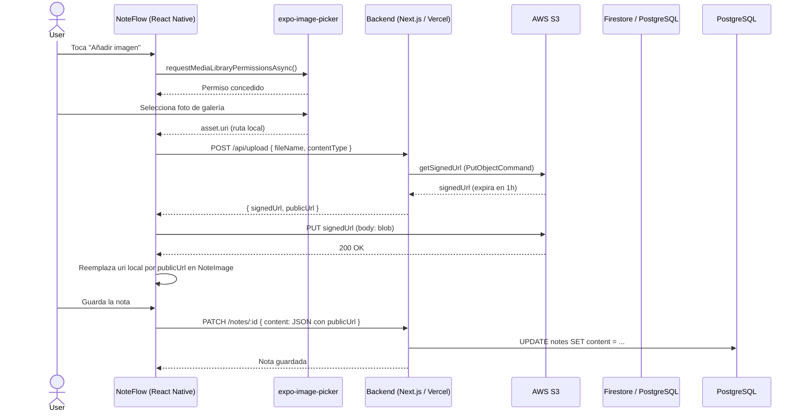
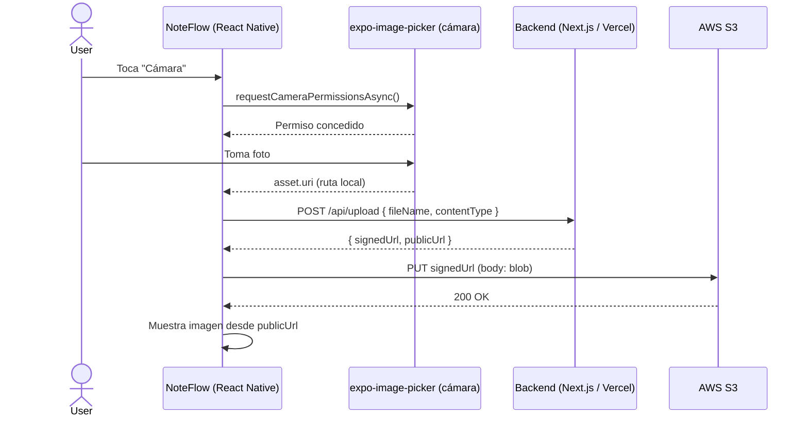

# Image Upload Flow

## Diagrama de flujo: Subir foto desde la app hasta AWS S3

## Flujo alternativo: Cámara

## Estructura de archivos involucrados

### App (React Native / Expo)
| Archivo | Función |
|---------|---------|
| `components/notes/NoteComposer.tsx` | UI de edición de notas, botón de imagen, integración con ImagePicker |
| `lib/upload.ts` | Servicio que pide presigned URL + sube el blob a S3 |
| `store/authStore.ts` | Manejo de sesión Firebase Auth + perfil en Firestore |
| `app/(auth)/login.tsx` | Pantalla de inicio de sesión |
| `app/(auth)/register.tsx` | Pantalla de registro |
| `app/_layout.tsx` | Listener de auth state, protección de rutas |

### Backend (Next.js)
| Archivo | Función |
|---------|---------|
| `app/api/upload/route.ts` | Endpoint POST que genera presigned URL firmada con AWS SDK |
| `lib/db.ts` | Conexión a PostgreSQL via Neon |
| `lib/notes.ts` | Operaciones CRUD de notas |

## Configuración necesaria

### Firebase
- Autenticación: Email/Password habilitado
- Firestore: Colección `users` con documentos por `uid`
- Archivos: `google-services.json` (Android) y `GoogleService-Info.plist` (iOS) en la raíz

### AWS S3
- Bucket: `noteflow-uploads-davidcorredera` (región `eu-north-1`)
- Permisos: Lectura pública para objetos
- IAM User: `noteflow-uploads` con política `AmazonS3FullAccess`

### Variables de entorno (Backend - Vercel)
| Variable | Valor |
|----------|-------|
| `AWS_ACCESS_KEY_ID` | Access Key del IAM user |
| `AWS_SECRET_ACCESS_KEY` | Secret Key del IAM user |
| `AWS_REGION` | `eu-north-1` |
| `AWS_S3_BUCKET` | `noteflow-uploads-davidcorredera` |

### Plugins (app.json)
- `expo-image-picker` → permisos de cámara y galería
- `@react-native-firebase/app` → integración nativa de Firebase
- `expo-build-properties` → compileSdk 36
