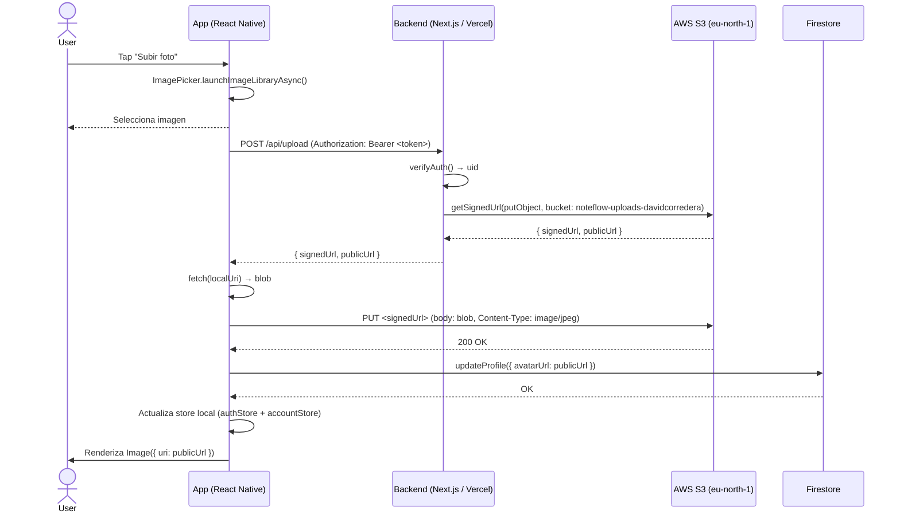
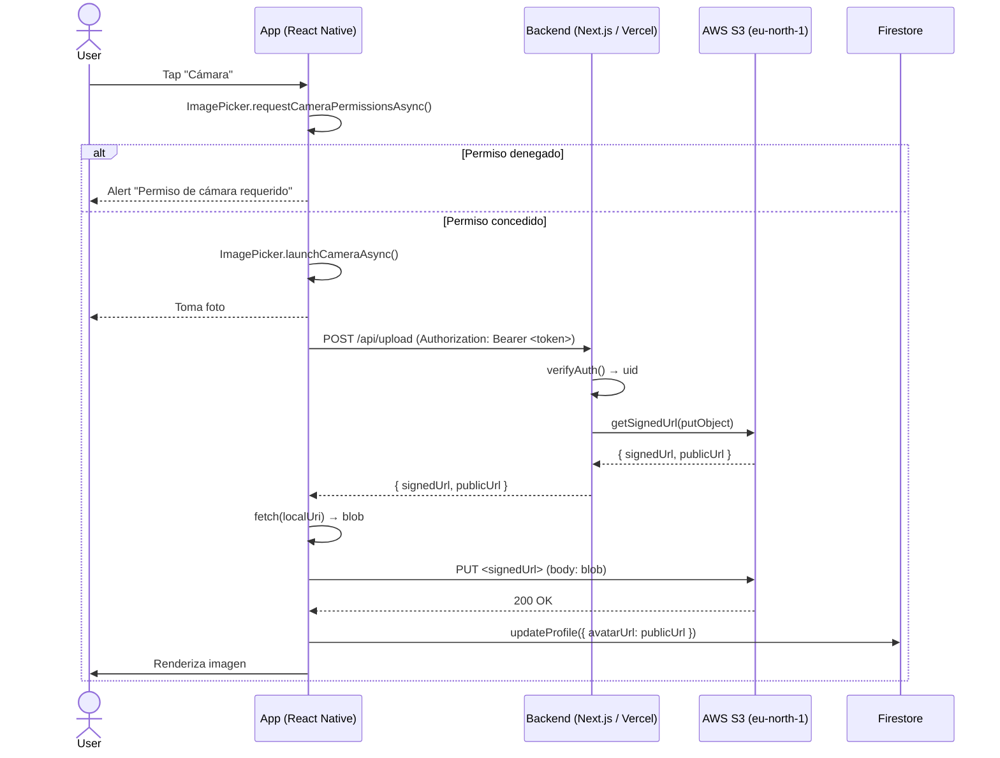

# Upload Flow — NoteFlow

## Diagrama de flujo: Galería

## Diagrama de flujo: Cámara

## Arquitectura

| Componente | Tecnología | Rol |
|---|---|---|
| App | React Native (Expo) | Captura imagen, la sube a S3 via presigned URL, actualiza Firestore |
| Backend | Next.js 16 (Vercel) | Autentica con Firebase Admin, genera presigned URL firmada por AWS |
| Storage | AWS S3 (eu-north-1) | Almacena objetos binarios (imágenes), las sirve como contenido público |
| Perfiles | Firestore | Guarda la URL pública (`avatarUrl`) para cada usuario |
| Identidad | Firebase Auth | Email/password, token JWT firmado |

## Flujo detallado

1. **Captura** — El usuario presiona su avatar en Ajustes y elige "Galería" o "Cámara". `expo-image-picker` devuelve la URI local del archivo.
2. **Solicitar URL firmada** — La app envía `POST /api/upload` con el token Firebase en el header `Authorization`. El backend verifica el token con `firebase-admin` y genera una presigned URL de S3 (`PutObjectCommand`, expira en 1 hora).
3. **Subida directa** — La app convierte la URI local a `blob` mediante `fetch(localUri)` y hace un `PUT` a la `signedUrl` con el blob como body.
4. **Persistencia** — La app actualiza Firestore (`users/{uid}.avatarUrl = publicUrl`) y los stores locales (`authStore.profile`, `accountStore`).
5. **Renderizado** — El componente `Image` de React Native carga desde la `publicUrl` de S3.

## Notas

- Las presigned URL expiran en 1 hora; la subida se hace inmediatamente después de seleccionar la imagen.
- La app envía el token Firebase (no las credenciales de AWS) al backend; S3 nunca expone claves al cliente.
- Las imágenes se almacenan con clave `uploads/{userId}/{timestamp}-{random}.jpg`.
- El bucket `noteflow-uploads-davidcorredera` es público para lectura (GetObject), pero la escritura solo se autoriza mediante presigned URL.
